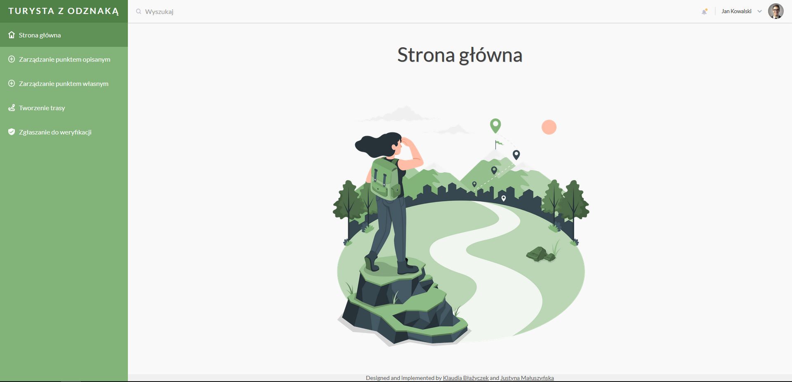

# Turysta z odznaką
The aim of the web app was to support GOT PTTK activity.
## Table of contents
* [General info](#general-info)
* [Technologies](#technologies)
* [Preview](#preview)
* [Authors](#authors)
* [Links](#links)

## General info
The project was made during Software Design university course. As a part of the course we created a wide documentation based on [ISO 12207](https://en.wikipedia.org/wiki/ISO/IEC_12207). Implementation covers only a few functionalities described in the documentation. Above-mentioned documentation is available only in Polish (Dokumentacja.pdf).

## Technologies
* Frontend - React
* Backend - Flask
* Database - MySQL

## Preview

## Authors
[Klaudia Błażyczek](https://github.com/Vesperalin) 
[Justyna Małuszyńska](https://github.com/justyna-maluszynska)

## Links
http://ktg.hg.pl/komisja-tg/got/regulamin_got.html  
http://www.ktg.hg.pl/komisja-tg/got/got.html
